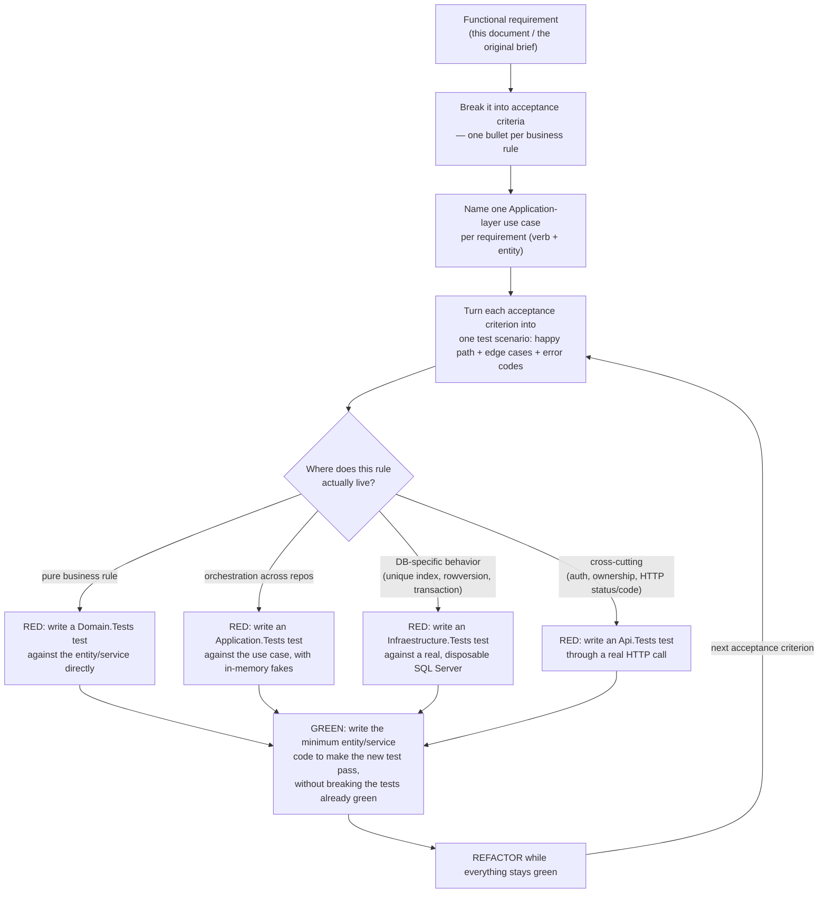

# Supermarket — Functional & Non-Functional Requirements

This document lists the requirements that drove this project, and explains — with real file and
test names, not a hypothetical example — how each requirement was turned into a use case, and how
each use case was turned into tests written *before* the production code that satisfies them
(TDD). It closes the loop between "what the business asked for" and "what a passing test suite
proves".

Related documents: [`README.md`](../README.md) (setup, commands, API reference),
[`docs/seed.md`](./seed.md) (seed data), [`docs/technical-presentation.md`](./technical-presentation.md)
(architecture, flow diagrams, demo script),
[`Supermarket_Interview_Project.md`](../Supermarket_Interview_Project.md) (the original brief).

## How to read this document

- **FR-\<module\>-\<n\>** — a Functional Requirement: something the system must *do*.
- **NFR-\<category\>-\<n\>** — a Non-Functional Requirement: a quality the system must *have*
  (security, consistency, reliability, usability, maintainability, testability, portability).
- Each requirement lists its **primary use case** (an `Application` layer class), the **domain
  rule** that enforces it (usually a `Domain` entity method, framework-independent), and a
  **representative set of tests** — not every test, but enough to point a reviewer at real
  evidence. Full lists are in the test files themselves.
- **Status** is `✅ Done` for everything in this repository — there are no partially-implemented
  requirements.

---

## 1. Functional requirements

### 1.1 Authentication (`Auth`)

#### FR-AUTH-1 — Register a new account
**Statement.** Anyone can create an account. The account is always created with the `Employee`
role; the client cannot request `Administrator`.

**Acceptance criteria**
- Name, email and password are required.
- Email must be syntactically valid and unique, case-insensitively.
- Password must be at least 8 characters and contain an uppercase letter, a lowercase letter and a
  digit.
- A `role` field sent in the request body is ignored.
- On success, returns a JWT access token and the created user.

**Use case** `Application/Authentication/RegisterUseCase.cs`
**Domain rule** `Domain/Entities/User.cs → User.Create()`
**Representative tests**
- Domain: `Domain.Tests/UserTests.cs` — `Create_ShouldCreateUserWithNormalizedEmail`,
  `Create_ShouldRejectInvalidEmail`, `Create_ShouldRejectEmptyPasswordHash`
- Application: `Application.Tests/AuthenticationTests.cs` —
  `Register_ShouldCreateEmployeeWithHashedPassword`,
  `Register_ShouldRejectDuplicatedEmailIgnoringCase`, `Register_ShouldRejectWeakPasswords`,
  `Register_ShouldRejectInvalidEmail`
- API: `Api.Tests/AuthApiTests.cs` — `Register_ShouldCreateAnEmployeeAndReturnAToken`,
  `Register_ShouldIgnoreAnAttemptToChooseTheAdministratorRole`,
  `Register_ShouldRejectDuplicatedEmail`, `Register_ShouldRejectWeakPasswords`

#### FR-AUTH-2 — Log in
**Statement.** A registered user exchanges email + password for a JWT access token.

**Acceptance criteria**
- Wrong password and an unknown email return the **same** error code (`INVALID_CREDENTIALS`) —
  the API never reveals whether an email is registered.
- The token carries the user id and role, and expires after a configured number of minutes.

**Use case** `Application/Authentication/LoginUseCase.cs`
**Representative tests**
- Application: `AuthenticationTests.cs` — `Login_ShouldReturnTokenForValidCredentials`,
  `Login_ShouldRejectWrongPassword`, `Login_ShouldRejectUnknownEmailWithTheSameError`
- Infrastructure: `Infraestructure.Tests/JwtTokenGeneratorTests.cs` —
  `Generate_ShouldEmitASignedTokenWithUserIdAndRole`, `Generate_ShouldExpireAfterTheConfiguredMinutes`
- API: `Api.Tests/AuthApiTests.cs` — `Login_ShouldReturnATokenForSeededUsers`,
  `Login_ShouldRejectWrongPasswordAndUnknownUserWithTheSameCode`

### 1.2 Products (`Products`)

#### FR-PROD-1 — Create a product
**Statement.** An Administrator registers a new product in the catalog.

**Acceptance criteria**
- Name, Brand, Category are required; UnitValue > 0; Cost >= 0; SalePrice >= Cost.
- Rejects an **active** duplicate with the same logical identity
  (Name + Brand + Category + UnitType + UnitValue, case-insensitive).
- Employees cannot call this endpoint (`403 Forbidden`).

**Use case** `Application/Products/CreateProductUseCase.cs`
**Domain rule** `Domain/Entities/Product.cs → Product.Create()`
**Representative tests**
- Domain: `Domain.Tests/ProductTests.cs` — `Create_ShouldRejectSalePriceLowerThanCost`,
  `Create_ShouldCreateProductWithValidData`, `Create_ShouldAcceptSalePriceEqualToCost`
- Application: `Application.Tests/ProductUseCasesTests.cs` — `Create_ShouldPersistProduct`,
  `Create_ShouldRejectDuplicatedActiveProductIgnoringCaseAndSpaces`,
  `Create_ShouldAllowSameNameWhenUnitValueDiffers`
- Infrastructure: `Infraestructure.Tests/PersistenceTests.cs` —
  `Product_UniqueIndexShouldBlockActiveDuplicatesAndReportDuplicateProduct` (the same rule
  enforced again at the database level, not just in application code)
- API: `Api.Tests/ProductsApiTests.cs` — `Post_ShouldCreateAProductAndReturnItsLocation`,
  `Post_ShouldRejectDuplicatedActiveProducts`, `Post_ShouldBeForbiddenForEmployees`

#### FR-PROD-2 — Update a product
**Statement.** An Administrator edits a product's information and pricing, and can
reactivate/deactivate it through the same call.

**Acceptance criteria**
- Same validation as creation; an invalid update leaves the product unmodified.
- Reactivating (`isActive: true`) re-checks for active duplicates.

**Use case** `Application/Products/UpdateProductUseCase.cs`
**Domain rule** `Product.Update()`, `Product.Activate()`, `Product.Deactivate()`
**Representative tests**
- Domain: `ProductTests.cs` — `Update_ShouldChangeInformationAndPricingTogether`,
  `Update_ShouldNotModifyProductWhenPricingIsInvalid`
- Application: `ProductUseCasesTests.cs` — `Update_ShouldChangeInformationAndPricing`,
  `Update_ShouldNotChangeAnythingWhenPricingIsInvalid`,
  `Update_ShouldRejectReactivatingWhenAnotherActiveDuplicateExists`
- API: `ProductsApiTests.cs` — `Put_ShouldUpdateTheProduct`, `Put_ShouldReturnNotFoundForUnknownProducts`

#### FR-PROD-3 — Deactivate a product (soft delete)
**Statement.** An Administrator removes a product from the active catalog without deleting sales
history that references it.

**Use case** `Application/Products/DeactivateProductUseCase.cs`
**Domain rule** `Product.Deactivate()`
**Representative tests**
- Application: `ProductUseCasesTests.cs` — `Deactivate_ShouldSoftDeleteTheProduct`
- API: `ProductsApiTests.cs` — `Delete_ShouldDeactivateInsteadOfRemoving`,
  `Delete_ShouldBeForbiddenForEmployees`

#### FR-PROD-4 — List and read products
**Statement.** Any authenticated user browses the catalog. Inactive products and cost data are
restricted.

**Acceptance criteria**
- `includeInactive=true` only has effect for Administrators; Employees always see active products.
- `Cost` is `null` in the response unless the caller is an Administrator.

**Use case** `Application/Products/GetProductsUseCase.cs`, `GetProductByIdUseCase.cs`
**Representative tests**
- Application: `ProductUseCasesTests.cs` — `GetProducts_ShouldHideInactiveProductsUnlessRequested`,
  `GetProducts_ShouldHideCostFromEmployees`, `GetProducts_ShouldShowCostToAdministrators`
- API: `ProductsApiTests.cs` — `Get_ShouldHideInactiveProductsFromEmployees`,
  `Get_ShouldLetAdministratorsSeeInactiveProducts`,
  `GetById_ShouldHideCostFromEmployeesAndShowItToAdministrators`

### 1.3 Inventory (`Inventory`)

#### FR-INV-1 — Register a batch
**Statement.** An Administrator registers a new batch (lot) of an existing, active product.

**Acceptance criteria**
- Quantity > 0 (and a whole number if the product's `UnitType` is `Unit`); MinimumStock >= 0;
  ExpirationDate > ReceivedDate.
- BatchNumber must be unique **per product** (two different products can reuse a batch number).
- Rejects an unknown or inactive product.

**Use case** `Application/Inventory/CreateStockUseCase.cs`
**Domain rule** `Domain/Entities/WarehouseStock.cs → WarehouseStock.Create()`,
`Product.IsValidQuantity()`
**Representative tests**
- Domain: `Domain.Tests/WarehouseStockTests.cs` — `Create_ShouldCreateStockWithValidData`,
  `Create_ShouldRejectZeroQuantity`, `Create_ShouldRejectExpirationBeforeReceivedDate`
- Application: `Application.Tests/InventoryUseCasesTests.cs` —
  `Create_ShouldRegisterBatchForActiveProduct`, `Create_ShouldRejectInactiveProduct`,
  `Create_ShouldRejectDuplicatedBatchNumberForTheSameProduct`,
  `Create_ShouldAllowSameBatchNumberForDifferentProducts`,
  `Create_ShouldRejectFractionalQuantityForUnitProducts`
- Infrastructure: `Infraestructure.Tests/PersistenceTests.cs` —
  `Stock_ShouldRejectDuplicatedBatchForTheSameProductThroughTheUniqueIndex`
- API: `Api.Tests/InventoryApiTests.cs` — `Post_ShouldRegisterABatchForAnActiveProduct`,
  `Post_ShouldRejectInactiveAndUnknownProducts`, `Post_ShouldBeForbiddenForEmployees`

#### FR-INV-2 — Update batch details
**Statement.** An Administrator corrects a batch's location, minimum stock, expiration date or
active flag — **never** its quantity.

**Use case** `Application/Inventory/UpdateStockUseCase.cs`
**Domain rule** `WarehouseStock.UpdateDetails()`
**Representative tests**
- Application: `InventoryUseCasesTests.cs` — `Update_ShouldChangeDetailsButNeverTheQuantity`
- API: `InventoryApiTests.cs` — `Put_ShouldUpdateDetailsButNeverTheQuantity`

#### FR-INV-3 — Restock a batch
**Statement.** An Administrator adds received quantity to an existing batch through a dedicated
action, separate from editing its details.

**Use case** `Application/Inventory/AddStockQuantityUseCase.cs`
**Domain rule** `WarehouseStock.AddQuantity()`
**Representative tests**
- Domain: `WarehouseStockTests.cs` — `AddQuantity_ShouldIncreaseQuantity`,
  `AddQuantity_ShouldRejectNonPositiveQuantity`
- Application: `InventoryUseCasesTests.cs` — `AddQuantity_ShouldIncreaseTheBatchQuantity`,
  `AddQuantity_ShouldRejectFractionalQuantityForUnitProducts`,
  `AddQuantity_ShouldWorkEvenWhenTheBatchIsInactive`
- API: `InventoryApiTests.cs` — `PostAddQuantity_ShouldIncreaseTheBatchQuantity`,
  `PostAddQuantity_ShouldBeForbiddenForEmployees`

#### FR-INV-4 — List and read batches, with low-stock / expired flags
**Statement.** Any authenticated user inspects inventory, optionally filtered by product,
low-stock or expired.

**Acceptance criteria** `IsLowStock` (`Quantity <= MinimumStock`) and `IsExpired`
(`ExpirationDate <= now`) are computed on read, never stored.

**Use case** `Application/Inventory/GetStocksUseCase.cs`, `GetStockByIdUseCase.cs`
**Domain rule** `WarehouseStock.IsLowStock()`, `WarehouseStock.IsExpired()`
**Representative tests**
- Domain: `WarehouseStockTests.cs` — `IsLowStock_ShouldBeTrueWhenQuantityEqualsMinimum`,
  `IsExpired_ShouldBeTrueAtExpirationDate`
- Application: `InventoryUseCasesTests.cs` — `GetStocks_ShouldFlagLowStockAndExpiredBatches`,
  `GetStocks_ShouldFilterByProduct`
- API: `InventoryApiTests.cs` — `Get_ShouldFlagExpiredAndLowStockBatchesFromTheSeed`

### 1.4 Sales (`Sales`)

#### FR-SALE-1 — Create a sale with backend-resolved price, batch and user
**Statement.** An authenticated user submits only `{ productId, quantity }` pairs. The backend
decides everything else.

**Acceptance criteria**
- The user is taken from the JWT, never from the request body.
- The unit price is the product's current `SalePrice` at the moment of the sale.
- A sale must contain at least one item; quantities must be positive (whole numbers for `Unit`
  products).
- Unknown or inactive products are rejected.

**Use case** `Application/Sales/CreateSaleUseCase.cs`
**Domain rule** `Domain/Entities/Sale.cs → Sale.Create()`, `Sale.AddItem()`, `Sale.Complete()`
**Representative tests**
- Domain: `Domain.Tests/SaleTests.cs` — `Complete_ShouldRejectSaleWithoutItems`,
  `Complete_ShouldMarkSaleAsCompletedAndCalculateTotal`
- Application: `Application.Tests/CreateSaleUseCaseTests.cs` —
  `ShouldTakeUserAndPriceFromTheBackend`, `ShouldRejectEmptySale`, `ShouldRejectUnknownProduct`,
  `ShouldRejectInactiveProduct`, `ShouldRejectFractionalQuantityForUnitProducts`
- API: `Api.Tests/SalesApiTests.cs` — `Post_ShouldIgnoreUserIdAndPricesSentByTheClient`,
  `Post_ShouldRejectEmptySalesAndInvalidQuantities`

#### FR-SALE-2 — FEFO batch allocation
**Statement.** Stock is consumed First-Expired-First-Out: the batch closest to expiring is used
first, splitting across batches when one isn't enough.

**Use case** `CreateSaleUseCase` (orchestrates), pure logic in the domain service
**Domain rule** `Domain/Services/FefoAllocator.cs → FefoAllocator.Allocate()`
**Representative tests**
- Domain: `Domain.Tests/FefoAllocatorTests.cs` — `Allocate_ShouldConsumeEarliestExpirationFirst`,
  `Allocate_ShouldNotDependOnInputOrder`, `Allocate_ShouldSkipExpiredLots`,
  `Allocate_ShouldSkipInactiveAndEmptyLots`, `Allocate_ShouldBreakTiesUsingReceivedDate`,
  `Allocate_ShouldRejectWhenOnlyExpiredStockExists`
- Application: `CreateSaleUseCaseTests.cs` — `ShouldConsumeStockUsingFefo`,
  `ShouldIgnoreExpiredBatchesWhenValidOnesExist`, `ShouldRejectWhenTheOnlyStockIsExpired`
- Infrastructure: `Infraestructure.Tests/SalesIntegrationTests.cs` —
  `CreateSale_ShouldApplyFefoAcrossRealBatches` (same rule, exercised against real SQL Server)

#### FR-SALE-3 — Atomic sale + inventory update
**Statement.** A sale and the inventory it consumes are written together, or not at all.

**Use case** `CreateSaleUseCase` + `Infraestructure/Persistance/UnitOfWork.cs`
**Representative tests**
- Application: `CreateSaleUseCaseTests.cs` — `ShouldRunInsideATransactionAndSaveOnce`,
  `ShouldNotConsumeAnyStockWhenASecondItemFails`,
  `ShouldRejectWhenStockIsInsufficientAndLeaveInventoryUntouched`
- Infrastructure: `SalesIntegrationTests.cs` — `CreateSale_ShouldLeaveNothingBehindWhenStockIsInsufficient`;
  `PersistenceTests.cs` — `Transaction_ShouldRollBackEverythingWhenTheActionFails`,
  `Transaction_ShouldCommitWhenTheActionSucceeds`
- API: `SalesApiTests.cs` — `Post_ShouldNotConsumeAnyStockWhenOneItemFails`

#### FR-SALE-4 — No overselling under concurrency
**Statement.** When two sales race for the same batch, at most one succeeds with the stock that
was actually available; the loser either retries successfully (if stock allows) or fails with a
clear error — it never both succeed and oversell.

**Acceptance criteria** Detected via the database's own `rowversion`; the use case retries up to
`CreateSaleUseCase.MaxAttempts = 3` times before giving up with `409 CONCURRENCY_CONFLICT`.

**Representative tests**
- Infrastructure: `PersistenceTests.cs` — `Stock_ShouldDetectConcurrentModificationsWithRowVersion`
- Application: `CreateSaleUseCaseTests.cs` —
  `ShouldRetryWhenAConcurrentSaleWonTheRaceButStockIsStillEnough`,
  `ShouldReportInsufficientStockWhenTheConcurrentSaleTookTheStock`,
  `ShouldGiveUpWithConflictAfterTooManyConcurrencyFailures` (simulated conflicts, fast)
- Infrastructure: `SalesIntegrationTests.cs` — `CreateSale_ConcurrentSalesMustNeverOversellTheSameStock`,
  `CreateSale_ManyConcurrentSalesShouldKeepStockConsistent` (real parallel writes against SQL Server)
- API: `Api.Tests/SalesApiTests.cs` — `ConcurrentSales_ShouldNeverOversell` (real parallel HTTP
  requests through Kestrel, the highest-fidelity proof of this requirement)

#### FR-SALE-5 — Historical price on the sale item
**Statement.** A sale item keeps the price it was sold at forever, even if the product's price
changes later.

**Representative tests**
- Domain: `Domain.Tests/SaleItemTests.cs` — `Create_ShouldCalculateSubtotal`
- Application: `CreateSaleUseCaseTests.cs` — `ShouldKeepHistoricalPriceWhenTheProductPriceChangesLater`
- API: `SalesApiTests.cs` — `Post_ShouldKeepTheHistoricalPriceAfterThePriceChanges`

#### FR-SALE-6 — Sales visibility by role
**Statement.** Employees see and read only their own sales; Administrators see and read every
sale; reading someone else's sale as an Employee returns `404`, not `403` (an id shouldn't reveal
that a sale exists).

**Use case** `Application/Sales/GetSalesUseCase.cs`, `GetSaleByIdUseCase.cs`
**Representative tests**
- Application: `Application.Tests/SalesQueriesTests.cs` — `GetSales_ShouldReturnOnlyOwnSalesForEmployees`,
  `GetSales_ShouldReturnEverySaleForAdministrators`, `GetSaleById_ShouldHideSalesOfOtherUsersFromEmployees`
- API: `SalesApiTests.cs` — `Get_ShouldReturnOnlyTheSalesOfTheCurrentEmployee`,
  `GetById_ShouldHideSalesOfOtherEmployees`

### 1.5 Tasks (`Tasks` — the GenAI-demonstration module)

#### FR-TASK-1 — Create a task
**Statement.** An authenticated user creates a personal task, owned by them, starting in `Pending`.

**Use case** `Application/Tasks/CreateUserTaskUseCase.cs`
**Domain rule** `Domain/Entities/UserTask.cs → UserTask.Create()`
**Representative tests**
- Domain: `Domain.Tests/TaskTests.cs` — `Create_ShouldCreatePendingTaskOwnedByUser`,
  `Create_ShouldRejectEmptyTitle`
- Application: `Application.Tests/UserTaskUseCasesTests.cs` —
  `Create_ShouldAssignTheTaskToTheCurrentUser`, `Create_ShouldRejectEmptyTitle`
- API: `Api.Tests/TasksApiTests.cs` — `Post_ShouldCreateAPendingTaskOwnedByTheCaller` (asserts a
  `userId` sent in the body is ignored), `Post_ShouldRejectEmptyTitles`

#### FR-TASK-2 — Task state machine
**Statement.** A task only moves `Pending → InProgress → Completed`, one step at a time, forward
only.

**Domain rule** `UserTask.Start()`, `UserTask.Complete()`, `UserTask.TransitionTo()`
**Representative tests**
- Domain: `TaskTests.cs` — `TransitionTo_ShouldFollowTheAllowedSequence`,
  `TransitionTo_ShouldRejectSkippingInProgress`, `TransitionTo_ShouldRejectGoingBackwards`,
  `TransitionTo_ShouldBeNoOpWhenStatusDoesNotChange`
- Application: `UserTaskUseCasesTests.cs` — `Update_ShouldChangeDetailsAndFollowTheStateMachine`,
  `Update_ShouldRejectInvalidTransitionAndKeepTheTaskUntouched`
- API: `TasksApiTests.cs` — `Put_ShouldFollowPendingInProgressCompleted`,
  `Put_ShouldRejectSkippingInProgressAndKeepTheTaskUntouched`, `Put_ShouldRejectGoingBackwards`

#### FR-TASK-3 — Ownership isolation
**Statement.** A user never sees, reads, edits or deletes another user's task — **including**
Administrators. A foreign task and a non-existent task are indistinguishable from the outside
(`404 TASK_NOT_FOUND`).

**Domain rule** `UserTask.IsOwnedBy()`; enforced structurally by
`IUserTaskRepository.GetByIdAsync(id, userId)`, which has no "any user" overload.
**Representative tests**
- Domain: `TaskTests.cs` — `IsOwnedBy_ShouldOnlyMatchTheOwner`
- Application: `UserTaskUseCasesTests.cs` — `List_ShouldReturnOnlyTheTasksOfTheCurrentUser`,
  `List_ShouldNotExposeTasksToAdministratorsEither`, `Get_ShouldReturnNotFoundForTasksOfOtherUsers`
- Infrastructure: `Infraestructure.Tests/PersistenceTests.cs` —
  `Task_RepositoryShouldNeverReturnTasksOfAnotherUser`
- API: `TasksApiTests.cs` — `Get_ShouldNotLetAdministratorsSeeOtherUsersTasks`,
  `GetPutDelete_ShouldReturnNotFoundForTasksOfOtherUsers`,
  `Get_ShouldNotLetAdministratorsReadATaskOfAnEmployee`

#### FR-TASK-4 — Delete a task
**Statement.** The owner permanently deletes their own task (unlike products, tasks are not
soft-deleted — nothing else references them).

**Use case** `Application/Tasks/DeleteUserTaskUseCase.cs`
**Representative tests**
- Application: `UserTaskUseCasesTests.cs` — `Delete_ShouldRemoveOwnTask`,
  `Delete_ShouldReturnNotFoundForTasksOfOtherUsers`
- API: `TasksApiTests.cs` — `Delete_ShouldRemoveTheTask`

---

## 2. Non-functional requirements

### 2.1 Security

#### NFR-SEC-1 — Passwords are never stored or logged in plain text
**How satisfied.** `Infraestructure/Authentication/PasswordHasher.cs` uses PBKDF2-HMAC-SHA512,
210,000 iterations, a random 16-byte salt per user, constant-time comparison
(`CryptographicOperations.FixedTimeEquals`).
**Verified by** `Infraestructure.Tests/PasswordHasherTests.cs` —
`Hash_ShouldNotContainThePlainPassword`, `Hash_ShouldUseADifferentSaltEachTime`,
`Verify_ShouldRejectMalformedHashesWithoutThrowing` (never throws on a corrupted hash).

#### NFR-SEC-2 — Every business fact comes from the server, never from client-supplied identity
**How satisfied.** `ICurrentUser` reads `UserId`/`Role` from JWT claims
(`WebAPI/Security/CurrentUser.cs`). No DTO in `Application` has a `UserId`, `UnitPrice` or
`BatchNumber` field for a client to set.
**Verified by** `Api.Tests/SalesApiTests.cs → Post_ShouldIgnoreUserIdAndPricesSentByTheClient`;
`Api.Tests/TasksApiTests.cs → Post_ShouldCreateAPendingTaskOwnedByTheCaller`;
`Api.Tests/AuthApiTests.cs → ProtectedEndpoints_ShouldRequireAToken`,
`ProtectedEndpoints_ShouldRejectAnInvalidToken`.

#### NFR-SEC-3 — Role-based authorization on write operations
**How satisfied.** `[Authorize(Policy = AuthenticationExtensions.AdministratorPolicy)]` on every
catalog/inventory write; `[Authorize]` (any role) on reads and on Sales/Tasks.
**Verified by** `Api.Tests/ProductsApiTests.cs → Post_ShouldBeForbiddenForEmployees`,
`Delete_ShouldBeForbiddenForEmployees`; `Api.Tests/InventoryApiTests.cs →
Post_ShouldBeForbiddenForEmployees`, `PostAddQuantity_ShouldBeForbiddenForEmployees`.

#### NFR-SEC-4 — Data visibility follows the role, not just the UI
**How satisfied.** `ProductResponse.Cost` is `decimal?`, resolved server-side from
`ICurrentUser.IsAdministrator`, so hiding the "Costo" column in Angular is a UX nicety, not the
actual guarantee.
**Verified by** `Api.Tests/ProductsApiTests.cs → GetById_ShouldHideCostFromEmployeesAndShowItToAdministrators`.

### 2.2 Data integrity & concurrency

#### NFR-DATA-1 — Atomicity of multi-table writes
**How satisfied.** `IUnitOfWork.ExecuteInTransactionAsync` wraps `CreateSaleUseCase` end to end.
**Verified by** `Application.Tests/CreateSaleUseCaseTests.cs → ShouldRunInsideATransactionAndSaveOnce`;
`Infraestructure.Tests/PersistenceTests.cs → Transaction_ShouldRollBackEverythingWhenTheActionFails`.

#### NFR-DATA-2 — No lost updates under concurrent writes
**How satisfied.** `WarehouseStock` maps to a SQL Server `rowversion` column; EF Core raises
`DbUpdateConcurrencyException` on a stale write, translated to `ConcurrencyConflictException`,
retried up to 3 times by `CreateSaleUseCase`.
**Verified by** (see FR-SALE-4 above — this NFR and that FR share the same evidence, at three
levels of fidelity: simulated in `Application.Tests`, real-DB-but-in-process in
`Infraestructure.Tests`, real-DB-over-real-HTTP in `Api.Tests → ConcurrentSales_ShouldNeverOversell`).

#### NFR-DATA-3 — Constraints enforced in the database, not only in code
**How satisfied.** A filtered unique index on `Products` (`IsActive = 1`) for the logical
identity, a unique index on `(ProductId, BatchNumber)`, a unique index on `Users.Email`, and a
`CHECK (Quantity >= 0)` constraint.
**Verified by** `Infraestructure.Tests/PersistenceTests.cs → Product_UniqueIndexShouldBlockActiveDuplicatesAndReportDuplicateProduct`,
`Stock_ShouldRejectDuplicatedBatchForTheSameProductThroughTheUniqueIndex`,
`User_ShouldEnforceUniqueEmail`, `Database_ShouldRejectNegativeQuantitiesThroughTheCheckConstraint`.

### 2.3 Reliability & error handling

#### NFR-REL-1 — Predictable, structured error responses
**How satisfied.** `WebAPI/Middleware/ExceptionHandlingMiddleware.cs` maps every
`DomainException`/`AppException`/`ConcurrencyConflictException` to the right HTTP status and an
`application/problem+json` body carrying a stable `code`; anything unexpected becomes a generic
`500` with no internal details leaked.
**Verified by** every `Api.Tests` file asserts both the HTTP status *and* the `code` string for
each error path (37 distinct assertions of this shape across the suite).

### 2.4 Usability

#### NFR-USE-1 — Errors are explained in plain language, in the app's language
**How satisfied.** `supermarket-web/src/app/core/api/api-error.ts` maps every backend `code` to a
Spanish sentence; unknown codes fall back to the server's `detail` instead of a blank message.
**Verified by** `supermarket-web/.../api-error.spec.ts → translates known codes into friendly
Spanish messages`; `tasks-page.spec.ts → shows a friendly message when the server rejects a
transition`; `sales-page.spec.ts → shows a friendly message and keeps the cart when there is not
enough stock`.

### 2.5 Maintainability & architecture

#### NFR-MAINT-1 — Business rules are independent of frameworks and infrastructure
**How satisfied.** `Domain.csproj` has no package references at all; `Domain` never imports EF
Core, ASP.NET or any Infrastructure type.
**Verified by** the fact that `Domain.Tests` (111 tests) runs in ~130 ms with zero I/O — proof
that the rules genuinely don't depend on a database.

### 2.6 Testability

#### NFR-TEST-1 — Every layer is independently and automatically testable
**How satisfied.** Four dedicated test projects, one per layer, each exercising only what that
layer is responsible for (see §3 below).
**Verified by** `dotnet test MarketApp.slnx` — 298 passing tests; `npm test -- --watch=false` in
`supermarket-web` — 54 passing tests.

### 2.7 Portability

#### NFR-PORT-1 — Reproducible local environment
**How satisfied.** `docker-compose.yml` provisions the exact SQL Server version the app targets;
`Infraestructure.Tests`/`Api.Tests` use Testcontainers to spin up their own disposable instance, so
tests don't depend on whatever is installed on the host.
**Verified by** the fact that this whole suite runs identically on a fresh machine with only
Docker + .NET 10 SDK installed — no local SQL Server, no seeded state carried over between runs.

---

## 3. From requirement to use case to test — the methodology

This is how each requirement above actually became code, in order:

**Worked example — FR-SALE-2 (FEFO), in the order it was actually built:**

1. **Requirement → acceptance criteria.** The brief's example (`L001: 10 @ Oct 1`,
   `L002: 20 @ Nov 1`, `L003: 30 @ Dec 1`, request 15 → take 10 from `L001` + 5 from `L002`) became
   a checklist: earliest-expiration-first, skip expired lots, skip inactive/empty lots, don't
   depend on input order, break ties by received date, fail clearly when stock is insufficient vs.
   when it's merely expired (two different error codes).
2. **Use case.** FEFO is not something `CreateSaleUseCase` should know the mechanics of — it's a
   pure allocation algorithm, so it became its own domain service, `FefoAllocator`, callable
   without a database.
3. **RED.** `Domain.Tests/FefoAllocatorTests.cs` was written first, calling a
   `FefoAllocator.Allocate(...)` that didn't exist yet — the project didn't compile.
4. **GREEN.** `Domain/Services/FefoAllocator.cs` was implemented with just enough logic
   (filter → order by `ExpirationDate`, then `ReceivedDate`, then `BatchNumber` → walk the list
   taking `min(batch.Quantity, remaining)`) to make all 13 scenarios in that file pass.
5. **One level up.** `Application.Tests/CreateSaleUseCaseTests.cs` was written next — RED again,
   this time against `CreateSaleUseCase`, which didn't call `FefoAllocator` yet — asserting the
   *use case* wires the allocator correctly, updates the right batches, and leaves inventory
   untouched when a line fails. `CreateSaleUseCase` was then implemented to make those pass
   (GREEN).
6. **Real database.** `Infraestructure.Tests/SalesIntegrationTests.cs →
   CreateSale_ShouldApplyFefoAcrossRealBatches` re-proves the same behavior against actual SQL
   Server rows, catching anything an in-memory fake could hide (e.g. how EF Core loads and tracks
   `WarehouseStock`).
7. **HTTP.** Finally `Api.Tests/SalesApiTests.cs → Post_ShouldSellUsingFefoAndUpdateInventory`
   proves the same rule survives serialization, authentication and routing.

Every other functional requirement in §1 was built the same way — domain rule first where the
rule is a pure business fact, use-case test where it's about orchestration, infrastructure test
where persistence details matter, API test where the HTTP/authorization contract is the point.
This repository does not keep separate RED/GREEN commits; the discipline is instead evidenced by
coverage itself — every acceptance criterion listed in §1 has at least one test enforcing it, and
the production code for a requirement has no reason to exist without the test that demanded it.

---

## 4. Traceability matrix (condensed)

| Requirement | Use case | Enforced in |
|---|---|---|
| FR-AUTH-1 Register | `RegisterUseCase` | `User.Create()` |
| FR-AUTH-2 Login | `LoginUseCase` | `PasswordHasher`, `JwtTokenGenerator` |
| FR-PROD-1 Create product | `CreateProductUseCase` | `Product.Create()` + unique index |
| FR-PROD-2 Update product | `UpdateProductUseCase` | `Product.Update()` |
| FR-PROD-3 Deactivate product | `DeactivateProductUseCase` | `Product.Deactivate()` |
| FR-PROD-4 List/read products | `GetProductsUseCase`, `GetProductByIdUseCase` | `ProductMapping.ToResponse(includeCost)` |
| FR-INV-1 Register batch | `CreateStockUseCase` | `WarehouseStock.Create()` + unique index |
| FR-INV-2 Update batch | `UpdateStockUseCase` | `WarehouseStock.UpdateDetails()` |
| FR-INV-3 Restock batch | `AddStockQuantityUseCase` | `WarehouseStock.AddQuantity()` |
| FR-INV-4 List/read batches | `GetStocksUseCase`, `GetStockByIdUseCase` | `IsLowStock()`, `IsExpired()` |
| FR-SALE-1 Create sale | `CreateSaleUseCase` | `Sale.Create()`, `Sale.AddItem()` |
| FR-SALE-2 FEFO | `CreateSaleUseCase` | `FefoAllocator.Allocate()` |
| FR-SALE-3 Atomicity | `CreateSaleUseCase` | `IUnitOfWork.ExecuteInTransactionAsync` |
| FR-SALE-4 No overselling | `CreateSaleUseCase` | `WarehouseStock.RowVersion` + retry |
| FR-SALE-5 Historical price | `CreateSaleUseCase` | `SaleItem.Create()` |
| FR-SALE-6 Sales visibility | `GetSalesUseCase`, `GetSaleByIdUseCase` | `ICurrentUser.IsAdministrator` |
| FR-TASK-1 Create task | `CreateUserTaskUseCase` | `UserTask.Create()` |
| FR-TASK-2 State machine | `UpdateUserTaskUseCase` | `UserTask.TransitionTo()` |
| FR-TASK-3 Ownership isolation | all `UserTask*UseCase` | `IUserTaskRepository.GetByIdAsync(id, userId)` |
| FR-TASK-4 Delete task | `DeleteUserTaskUseCase` | `IUserTaskRepository.Remove()` |
| NFR-SEC-1..4 | `PasswordHasher`, `ICurrentUser`, `[Authorize]` policies | across all controllers |
| NFR-DATA-1..3 | `UnitOfWork`, EF configurations | `Infraestructure/Persistance/Configurations` |
| NFR-REL-1 | `ExceptionHandlingMiddleware` | `WebAPI/Middleware` |
| NFR-USE-1 | `api-error.ts` | `supermarket-web/src/app/core/api` |
| NFR-MAINT-1, NFR-TEST-1, NFR-PORT-1 | the four-project split + Testcontainers + Docker Compose | solution-wide |

Every row has `Status: ✅ Done`, backed by the tests cited in §1 and §2. Run `dotnet test
MarketApp.slnx` (298 tests) and, in `supermarket-web`, `npm test -- --watch=false` (54 tests) to
reproduce the evidence yourself.
