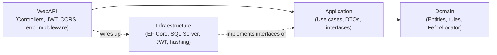
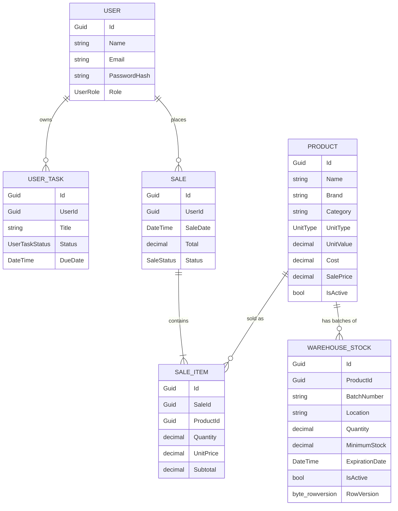
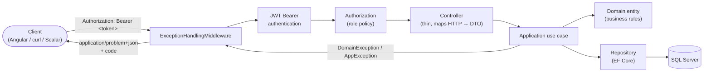
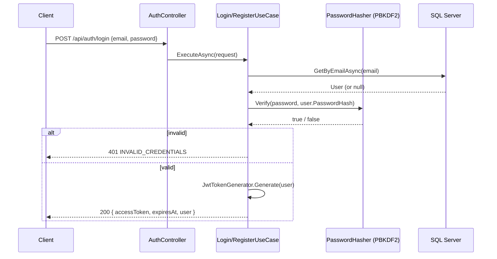
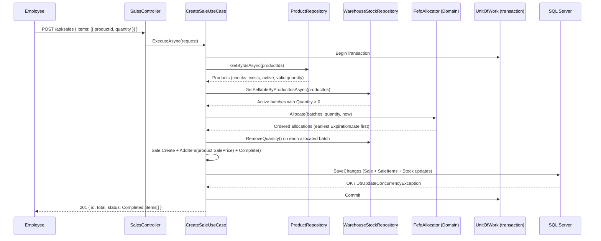
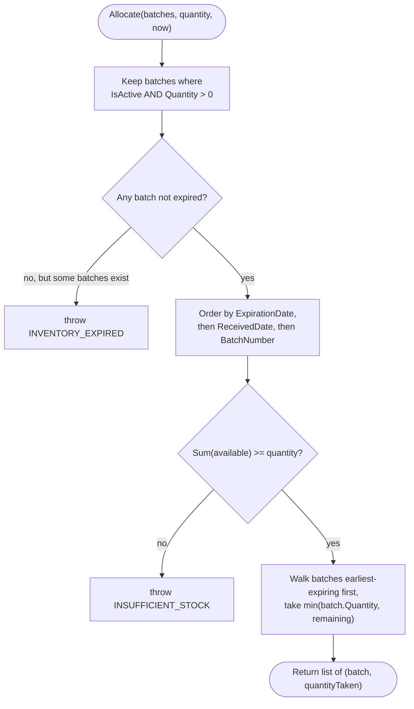
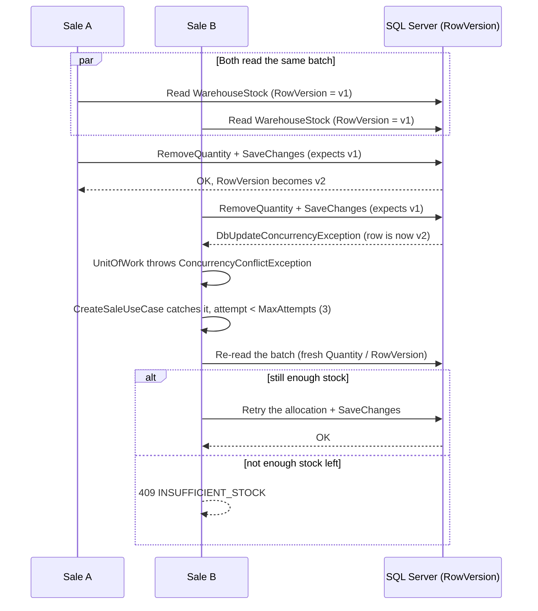
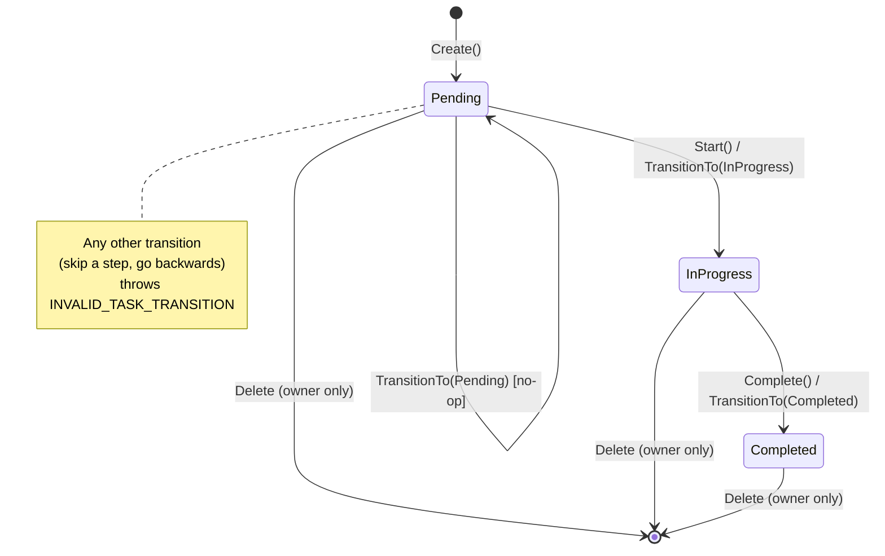
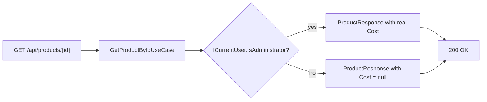
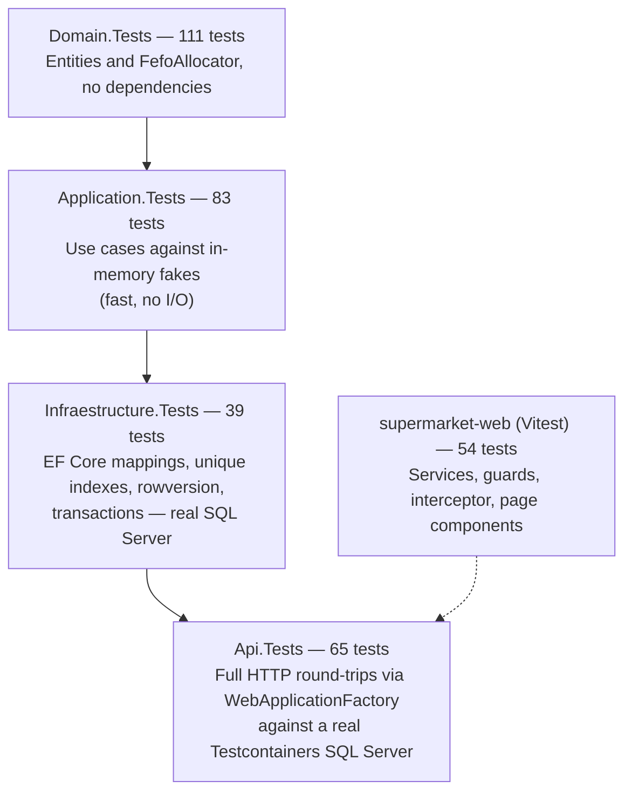

# Supermarket — Technical Interview Presentation

This document supports the live presentation to the technical interview panel. It covers the user
story behind the project, the design choices and trade-offs, the technical architecture, and a
script to demonstrate the running application. Diagrams are Mermaid so they render directly on
GitHub and in most Markdown viewers.

Related documents: [`README.md`](../README.md) (setup, test commands, API reference),
[`docs/seed.md`](./seed.md) (seed data and the scenarios it covers),
[`Supermarket_Interview_Project.md`](../Supermarket_Interview_Project.md) (the original exercise brief).

---

## 1. User story

A small supermarket needs a system to run its daily operations: keep a product catalog, track
inventory in batches (because food expires), record sales without ever overselling, and let staff
track their own follow-up work. Two roles use the system:

- **Administrator** — owns the catalog and the warehouse.
- **Employee** — sells products and manages personal tasks.

| # | As a... | I want to... | So that... |
|---|---|---|---|
| 1 | Administrator | create, edit and deactivate products | the catalog stays accurate without losing sales history that references old products |
| 2 | Administrator | register inventory batches with an expiration date | the system knows exactly what is sellable and what isn't |
| 3 | Administrator | restock a batch | I can add quantity received from a supplier without re-registering the batch |
| 4 | Employee | see products without their cost | I can sell without seeing margin-sensitive data I'm not authorized to see |
| 5 | Employee | sell a product by just picking it and a quantity | the system — not me — decides the price, the batch and whether there's enough stock |
| 6 | Employee | have the system pick the batch closest to expiring first (FEFO) | we lose the least product to spoilage |
| 7 | Employee | not be able to oversell when two sales happen at the same time | the shop never promises stock it doesn't have |
| 8 | Employee | see only my own sales and tasks | I can't see or touch a colleague's data, and neither can an Administrator |
| 9 | Employee | move a task from Pending → In progress → Completed | I can track my own follow-up work, with the system stopping me from skipping a step |
| 10 | Any authenticated user | register and log in | I get a JWT that scopes every request to my identity and role |

These stories map 1:1 to the four business modules — **Products**, **Inventory**, **Sales**,
**Tasks** — plus **Auth** underneath all of them.

---

## 2. Design choices

### 2.1 Clean Architecture, strictly one-directional

`Domain` has zero dependencies — not even on Entity Framework. `Application` only knows Domain and
its own interfaces (`IProductRepository`, `IUnitOfWork`, `ICurrentUser`, …). `Infraestructure`
implements those interfaces. `WebAPI` wires everything together at startup and stays thin:
controllers only translate HTTP ↔ use cases.

### 2.2 TDD, RED → GREEN → REFACTOR

Every entity behavior and every use case was written test-first. The Domain suite alone has 111
tests; the whole solution has 298 backend tests plus 54 Angular tests. `dotnet test` and
`npm test -- --watch=false` are both part of the normal workflow, not an afterthought.

### 2.3 Rich domain, thin controllers

Business rules live in the entities, not in controllers or services:

- `Product.Update()` validates name/brand/category/unit and pricing (`SalePrice >= Cost`) *before*
  assigning anything, so an invalid update never leaves the object half-modified.
- `WarehouseStock.RemoveQuantity()` refuses to go negative.
- `Sale.Complete()` refuses an empty sale and refuses to be completed twice.
- `UserTask` owns its own state machine (see §4.5) — nothing outside the entity can force an
  illegal transition.

### 2.4 Domain error codes, not exception messages

`DomainException` and `AppException` both carry a stable `Code` (`INSUFFICIENT_STOCK`,
`PRODUCT_INACTIVE`, `INVALID_TASK_TRANSITION`, …). A single exception-handling middleware maps
these to the right HTTP status and a `application/problem+json` body with that `code` field. The
frontend translates codes into Spanish messages in one place
(`core/api/api-error.ts`) instead of parsing free-text errors.

### 2.5 Explicit trade-offs

| Decision | Why |
|---|---|
| Products are **soft-deleted** (`IsActive`), tasks are **hard-deleted** | Products are referenced by historical sales; tasks are personal notes nothing else points to. |
| Sale price and batch are **never** taken from the client | `CreateSaleRequest` only carries `productId` + `quantity`. The backend is the only source of truth for price and FEFO. |
| Product cost is hidden from Employees | `ProductResponse.Cost` is `decimal?`, resolved from `ICurrentUser.IsAdministrator` — margin data is not an Employee's business. |
| Optimistic concurrency (`rowversion`) with a bounded retry, not a database lock | Keeps normal traffic fast; only actually-colliding sales pay the retry cost. |
| No microservices, no CQRS/MediatR, no Event Sourcing, no Redis/broker/Outbox | The problem doesn't need them yet; adding them now would be complexity nobody asked for. See §7. |

---

## 3. Technical architecture

### 3.1 Stack

| Layer | Technology |
|---|---|
| Backend | .NET 10, ASP.NET Core Web API, Entity Framework Core |
| Database | SQL Server 2022 (Docker) |
| Auth | JWT Bearer, PBKDF2-SHA512 password hashing (210,000 iterations, per-user salt) |
| API docs | `Microsoft.AspNetCore.OpenApi` + Scalar UI (`/scalar/v1`) |
| Frontend | Angular (standalone components, signals, Reactive Forms, an `HttpInterceptor` for the JWT) |
| Testing | MSTest (xUnit-style `Assert.Throws`) + Testcontainers for real SQL Server in CI-like tests; Vitest for Angular |

### 3.2 Domain model

`RowVersion` on `WarehouseStock` is what makes optimistic concurrency possible (§4.4).
`SaleItem.UnitPrice` is a frozen copy of the price at sale time — it never changes even if
`Product.SalePrice` changes afterwards.

### 3.3 Request pipeline

Every exception — domain rule violation, not-found, forbidden, concurrency conflict — funnels
through the same middleware, so the API never leaks a raw 500 with a stack trace for an expected
business error.

---

## 4. Key flows

### 4.1 Authentication

The JWT carries `sub` (user id), `email`, `name`, a custom `role` claim, and a `jti`. Every other
controller reads `ICurrentUser.UserId` / `.Role` from those claims — **never** from anything the
client sends in the body.

### 4.2 Create sale — FEFO, transaction, price from the backend

If **any** line fails (unknown product, inactive product, insufficient stock, only-expired stock),
nothing is written: the whole operation is one transaction, and the use case validates every line
before touching inventory.

### 4.3 FEFO allocation (pure domain logic)

Example from `docs/seed.md`: `L001` (10 units, expires first), `L002` (20, expires later), `L003`
(30, expires last). A request for 15 units takes **10 from L001 + 5 from L002**, leaving L003
untouched — exactly the example in the original exercise brief.

### 4.4 Concurrency: two sales racing for the same batch

`CreateSaleUseCase.MaxAttempts = 3`. After 3 straight `ConcurrencyConflictException`s (an
adversarial scenario used only in tests), the use case gives up with `409 CONCURRENCY_CONFLICT`
instead of retrying forever. This is exercised for real against SQL Server — not mocked — in
`Infraestructure.Tests` and `Api.Tests` (parallel `Task.WhenAll` sales hitting the same batch).

### 4.5 Task state machine (the GenAI-demonstration module)

The state machine lives entirely inside `UserTask` (`Move()`), not in the controller or the use
case — the API layer cannot bypass it. `ITaskRepository.GetByIdAsync(id, userId)` always takes the
current user, so a task belonging to someone else is indistinguishable from a task that doesn't
exist (`404 TASK_NOT_FOUND`) — even for an Administrator.

### 4.6 Role-based product view (cost hiding)

The Angular product list conditionally renders the "Costo" column and the create/edit form only
for `isAdministrator()` — but the real guarantee is server-side: an Employee's HTTP response
literally has `"cost": null`, verified end-to-end in `Api.Tests`.

---

## 5. Live demonstration script

Suggested order for the panel, roughly 8–10 minutes:

1. **Boot the stack** — `docker compose up -d`, `dotnet run --project WebAPI`, `npm start` in
   `supermarket-web`. Mention the seed data loads automatically in `Development`
   (`docs/seed.md`).
2. **Open Scalar** (`http://localhost:5203/scalar/v1`) — show the JWT security scheme, pick one
   endpoint (e.g. `POST /api/sales`) and point out the documented summary, response codes and the
   auto-generated `curl` example. This is the fastest way to show the whole API surface without
   opening every controller file.
3. **Log in as `admin@supermarket.local`** in the Angular app.
   - Products: create a new product, try a sale price lower than cost (rejected client-side and
     server-side), show the "Costo" column only visible to admins.
   - Inventory: register a batch, then use the new **"Agregar" (restock)** control to increase its
     quantity — point out `PUT` never touches `Quantity`, only `POST .../add-quantity` does.
4. **Log out, log in as `employee1@supermarket.local`.**
   - Products: same list, no "Costo" column, no create/edit buttons.
   - Sales: sell `Leche Entera` — the seeded batches (`L001`/`L002`/`L003`) let you show FEFO live:
     sell 15 units and open the Inventory tab to show `L001` fully drained and `L002` partially
     drained, `L003` untouched.
   - Try to oversell (e.g. `Detergente Líquido`, seeded with 0 stock) → `409 INSUFFICIENT_STOCK`
     with the friendly Spanish message from `api-error.ts`.
   - Tasks: walk a task from Pending → In progress → Completed; try to skip a step by editing the
     PUT payload directly (via Scalar) to jump straight to `Completed` → `409
     INVALID_TASK_TRANSITION`.
5. **Second employee** (`employee2@supermarket.local`) to show isolation: their task list is
   empty even though `employee1` has tasks; opening `employee1`'s sale by id returns `404`.
6. **Tests** — `dotnet test MarketApp.slnx` and `npm test -- --watch=false` live, or show the last
   run: 298 backend tests + 54 Angular tests, including real-SQL-Server concurrency tests and a
   full HTTP integration suite (`Api.Tests`) with no mocks at that layer.

---

## 6. Testing pyramid

298 backend tests, 54 frontend tests, **all green**. `Infraestructure.Tests` and `Api.Tests` are
deliberately *not* mocked at the database boundary — they run against a disposable SQL Server
container per test run, so a passing suite means the EF mappings, the unique indexes and the
rowversion concurrency actually work against the real engine, not an in-memory stand-in.

---

## 7. Deliberately out of scope

Carried over from the original brief and still true after implementation — none of these solve a
problem this system actually has yet:

Microservices, CQRS/MediatR, Event Sourcing, complex Domain Events, Redis, a message broker, the
Outbox pattern, Kubernetes. Adding them now would be solving imaginary scale/complexity problems
at the cost of a slower, harder-to-review codebase — the opposite of what Clean Architecture and
TDD are for.

---

## 8. Where to look in the code

| Topic | Start here |
|---|---|
| Business rules | `Domain/Entities/*.cs`, `Domain/Services/FefoAllocator.cs` |
| Orchestration | `Application/Sales/CreateSaleUseCase.cs` (the most complete example) |
| Concurrency | `Infraestructure/Persistance/UnitOfWork.cs`, `Domain.Tests`/`Api.Tests` concurrency tests |
| Security | `Infraestructure/Authentication/*.cs`, `WebAPI/Security/CurrentUser.cs` |
| API documentation | `WebAPI/OpenApi/*.cs`, or just open `/scalar/v1` |
| GenAI-demonstration module | `Domain/Entities/UserTask.cs` and everything referencing `UserTask` — the only files with inline comments, explaining the design and what was corrected after reviewing the generated code |
